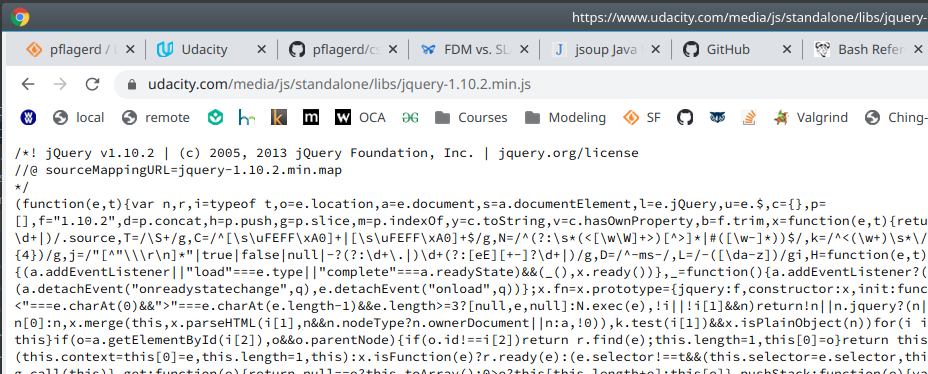

Working on "HtmlInliner with inline base64 images"

Exception in thread "main" java.io.IOException: Server returned HTTP response code: 403 for URL: https://www.udacity.com/media/js/standalone/libs/jquery-1.10.2.min.js
​	at sun.net.www.protocol.http.HttpURLConnection.getInputStream0(HttpURLConnection.java:1840)

Tried -Dcom.sun.net.ssl.checkRevocation=false in VM args.

The problem occurs when I attempt to connect to the following:

```
Exception in thread "main" java.io.IOException: Server returned HTTP response code: 403 for URL: https://www.udacity.com/media/js/standalone/libs/jquery-1.10.2.min.js
	at sun.net.www.protocol.http.HttpURLConnection.getInputStream0(HttpURLConnection.java:1840)
	at sun.net.www.protocol.http.HttpURLConnection.getInputStream(HttpURLConnection.java:1441)
	at sun.net.www.protocol.https.HttpsURLConnectionImpl.getInputStream(HttpsURLConnectionImpl.java:254)
	at java.net.URL.openStream(URL.java:1045)
	at org.apache.commons.io.IOUtils.toString(IOUtils.java:2764)
	at org.apache.commons.io.IOUtils.toString(IOUtils.java:2721)
	at org.apache.commons.io.IOUtils.toString(IOUtils.java:2737)
	at com.pflager.HtmlInliner.inlineAUrl(HtmlInliner.java:57)
	at com.pflager.HtmlInliner.main(HtmlInliner.java:84)
```

However, if I use that URL in a browser, I get the desired results:




So as a test, I create the `ConnectHttpsSimple` class, and run it.  Predictably, I see the error:


So I try a work-around from another class `ConnectHttps` which turns off SSL checking:


This work-around apparently doesn't work.


So I'm guessing that the certificates in the JRE I'm using are expired.


So I switch to java 1.11.7, and try again.

I get much further, although I do get this error:

```
Exception in thread "main" java.io.FileNotFoundException: https://www.udacity.com/media/wiki/google-code-prettify/prettify.js?63da327b90d891d754a294e44d499078
	at java.base/sun.net.www.protocol.http.HttpURLConnection.getInputStream0(HttpURLConnection.java:1915)
	at java.base/sun.net.www.protocol.http.HttpURLConnection.getInputStream(HttpURLConnection.java:1515)
	at java.base/sun.net.www.protocol.https.HttpsURLConnectionImpl.getInputStream(HttpsURLConnectionImpl.java:250)
	at java.base/java.net.URL.openStream(URL.java:1140)
	at org.apache.commons.io.IOUtils.toString(IOUtils.java:2764)
	at org.apache.commons.io.IOUtils.toString(IOUtils.java:2721)
	at org.apache.commons.io.IOUtils.toString(IOUtils.java:2737)
	at com.pflager.HtmlInliner.inlineAUrl(HtmlInliner.java:57)
	at com.pflager.HtmlInliner.main(HtmlInliner.java:84)
```

Which objectively does NOT appear to exist even as `https://www.udacity.com/media/wiki/google-code-prettify/prettify.js`.

I guess I should not fail, but should simply not replace such `<script>` tags.

